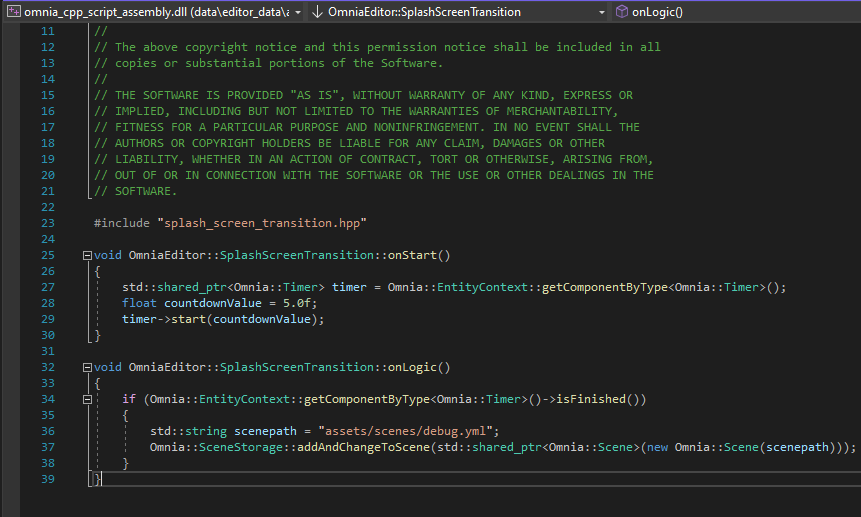
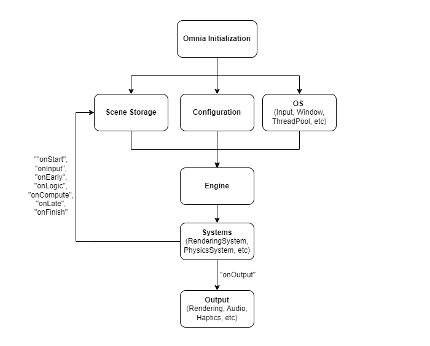
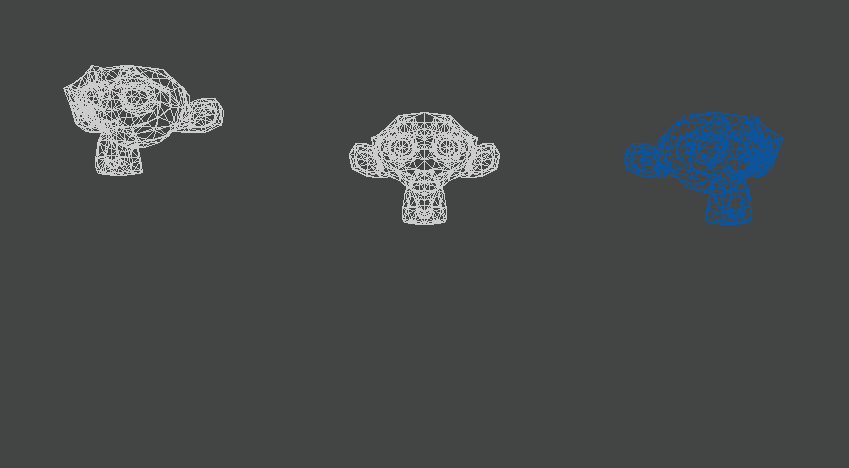

# [Omnia](https://github.com/Jean-LouisH/Omnia)

["Niagara Falls" by Brian Trepanier](https://sketchfab.com/3d-models/niagara-falls-ontario-canada-1799ed0c63394570beed917b99807915) stored in a Model Component in a Scene and rendered in Omnia's RenderingSystem with a basic phong Shader. The white cube contains a Light Component and is rendered with a separate unlit Shader.

**This project is in pre-alpha**

[Omnia](https://github.com/Jean-LouisH/Omnia) is a game engine I'm developing for fun, study and technical demonstrations. It doubles as an interactive software framework. It is designed to be customizable, general purpose, data-driven, and lightweight.

The name "Omnia" stems from the prefix "Omni-" which means "all." It is loosely based on the term "Omnific" which means ["all-creating"](https://www.merriam-webster.com/dictionary/omnific).

# Table of Contents

* [Notable Features](#notable-features)
* [Architecture](#architecture)
* [Dependencies](#dependencies)
* [Compilation Instructions](#compilation-instructions)
* [Manual](#manual)
* [Demos](#demos)
* [License](#license)

# Notable Features

- Project-based, data-driven applications, deserialized as YAML files via yaml-cpp

- OpenGL Rendering Backend with GLSL, Scenes of multiple SceneLayers (2D and 3D) via depth buffer refresh

- SceneLayer EventBus for a publish/subscribe architecture

- Model loading via TinyGLTF, including Mesh and Material texture maps

- Python VM scripting via pybind11 with game loop calls to Python and Engine API calls from Python. Imports, including pip installed packages are supported.

- C++ scripting via native shared library builds

- Fully customizable as a core framework loading custom Component and System classes on initialization

- Entity-Component-System (ECS) architecture
- Game Controller and Haptic Feedback support
- Multithreaded Systems

# Architecture

Omnia functions by retaining a collection of Scenes and processing them in a main Engine class. On every loop, one active Scene is passed to the Engine's collection of Systems where each of them can update the Scene and or generate outputs from it. 

The Engine facilitates this by reading inputs on the main thread, allocating dedicated threads to update and output methods, and coordinating their loops through order of operations and target frame rates. At the same time it retains states for initializing, running, restarting and finalizing

Scenes consist of 2D and 3D SceneLayers. They can generate these through deserializing YAML files. Each SceneLayer consists of collections of Entities and Components. It has objects for specialized and general events such; a CollisionRegistry; an EventBus; and a HapticSignalBuffer. It is also augmented with collections of IDs that help to optimize search queries on it, in real-time, to constant time complexity. 

An Entity represents an object that exists in the SceneLayer. It mostly consists of IDs for other Entities that form a tree-like relationship with it through a parent ID and a list of child IDs. It also has a dictionary of component IDs that are attached to it.

Components are data containers for their host Entities. Their data are specialized for specific ways in which an Entity is expected to be represented. For example, an Entity with a Transform and Model Component attached to it is capable of existing in physical locations as a visible 2D/3D object. With a PhysicsBody Component added to that, it would be capable of falling under gravity. Finally, with a ScriptCollection Component added to that, it would be able to override the properties of the PhysicsBody and Model and effectively store any additional data or have the Entity behave in any other way the developer wishes. 

Animation showing three Suzannes lined up with one stationary (Transform only), another falling under gravity (with a PhysicsBody), and another falling while zig-zagging and changing colour (with a ScriptCollection).

Components may contain Assets, which are immutable objects containing resource data from memory or files. Some examples of these are Images and AudioStreams. Assets may appear in other parts of the Engine as needed, such as the Image object in the Window icon generation in Engine start up. Assets are immutable so that they may be reliably cached and instanced in Systems that need them to be constant, such as Images that represent textures in a cache that are already uploaded to the GPU in a RenderingSystem. If the Image were changeable in this case, the Image data would not match with the texture data in the GPU but would represent it in the texture cache. Consequently, the user would never see a change in texture on screen.

Scenes, SceneLayers, Entities, Components, and Assets all retain IDs for caching wherever needed.

Systems process Scenes by events in the Engine loops. These include "onStart", "onInput", "onEarly", "onLogic", "onCompute", "onLate", "onOutput" and "onFinish". "onEarly" and "onFinish" represent the events in which the SceneLayers would address Entities that are newly created or about to be deleted. "onInput" represents the event in which an input state is changed. "onEarly", "onLogic", "onLate" in that order represent a linear chain of events, that allow operations to be done in a specific order. "onCompute" is an event that enables the System to have fixed updates to real-time by catching up to dropped frames and simulation lag. This can be CPU intensive, so should it be reserved to small, optimized processes that depend on it. "onOutput" represents an event where processing occurs on a separate output thread to all of the other event names. Operations here are expected to be read-only.

This summarizes how the Engine operates. Users can also extend it through the ClassRegistry header where their own custom Components or Systems can be made and instantiated in the ClassRegistry.addDefinitions() method.

# Dependencies

- [Embeddable Python 3.7](https://www.python.org/downloads/release/python-370/)
- [GLAD](https://glad.dav1d.de/)
- [OpenGL Mathematics](https://github.com/g-truc/glm)
- [Pybind11](https://github.com/pybind/pybind11)
- [SDL2](https://www.libsdl.org/)
- [SDL2_mixer](https://www.libsdl.org/projects/SDL_mixer/)
- [STB Image](https://github.com/nothings/stb)
- [TinyGLTF](https://github.com/syoyo/tinygltf)
- [YAML-CPP](https://github.com/jbeder/yaml-cpp)

# Compilation Instructions

* Get the dependency libraries listed above.
* To be able to install third-party packages in Embeddable Python 3.7, uncomment the last line in python37._pth. Then download [get-pip.py](https://bootstrap.pypa.io/get-pip.py), place it in the embeddable python folder, and run `> python get-pip.py`. Install packages to the embeddable folder with `> python -m pip install package-name`.
* Include this source directory in CMake to generate a project from the top level CMakeLists.txt. 
* Set the `CMAKE_CONFIGURATION_TYPES` to the build configuration you want. 
* Use your C++ IDE or compiler of choice to build Omnia and Tests from the project.

# Manual

# Demos

- Pong

# License

MIT License

Copyright (c) 2020 Jean-Louis Haywood

Permission is hereby granted, free of charge, to any person obtaining a copy
of this software and associated documentation files (the "Software"), to deal
in the Software without restriction, including without limitation the rights
to use, copy, modify, merge, publish, distribute, sublicense, and/or sell
copies of the Software, and to permit persons to whom the Software is
furnished to do so, subject to the following conditions:

The above copyright notice and this permission notice shall be included in all
copies or substantial portions of the Software.

THE SOFTWARE IS PROVIDED "AS IS", WITHOUT WARRANTY OF ANY KIND, EXPRESS OR
IMPLIED, INCLUDING BUT NOT LIMITED TO THE WARRANTIES OF MERCHANTABILITY,
FITNESS FOR A PARTICULAR PURPOSE AND NONINFRINGEMENT. IN NO EVENT SHALL THE
AUTHORS OR COPYRIGHT HOLDERS BE LIABLE FOR ANY CLAIM, DAMAGES OR OTHER
LIABILITY, WHETHER IN AN ACTION OF CONTRACT, TORT OR OTHERWISE, ARISING FROM,
OUT OF OR IN CONNECTION WITH THE SOFTWARE OR THE USE OR OTHER DEALINGS IN THE
SOFTWARE.